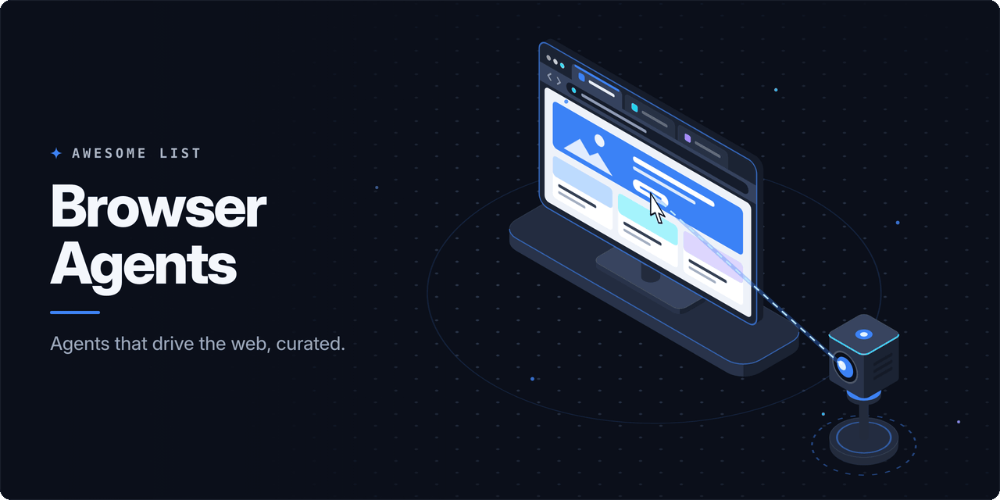

<!-- awesome:hero --><!-- /awesome:hero -->

<!-- awesome:title --><h1 align="center">Awesome Browser Agents</h1><!-- /awesome:title -->

<!-- awesome:tagline -->Agentic browsers, browser automation frameworks for agents, hosted browser infrastructure and the protocols that connect them.<!-- /awesome:tagline -->

<!-- awesome:badges -->

  
  
  

<!-- /awesome:badges -->

A browser agent is an AI model that reads web pages and acts on them, clicking, typing and navigating to finish a task for a person. This list covers the browsers built around such agents, the frameworks and servers that let agents drive a browser, the cloud browsers they run in, and the models, protocols and benchmarks behind them.

## Contents

- [Agentic browsers](#agentic-browsers)
- [Agents and assistants](#agents-and-assistants)
- [Agent frameworks](#agent-frameworks)
- [MCP servers and CLIs](#mcp-servers-and-clis)
- [Cloud browser infrastructure](#cloud-browser-infrastructure)
- [Headless and stealth browsers](#headless-and-stealth-browsers)
- [Computer-use models](#computer-use-models)
- [Protocols and standards](#protocols-and-standards)
- [Benchmarks and leaderboards](#benchmarks-and-leaderboards)
- [Related lists](#related-lists)
- [Contributing](#contributing)

## Agentic browsers

- [BrowserOS](https://github.com/browseros-ai/BrowserOS) - Open-source second browser that agents drive with your imported logins, one tab per agent.
- [ChatGPT Atlas](https://chatgpt.com/atlas) - OpenAI's browser with ChatGPT built in and an agent mode that acts on pages for you.
- [Comet](https://www.perplexity.ai/comet) - Perplexity's Chromium-based browser with an assistant that browses and completes tasks.
- [Dia](https://www.diabrowser.com) - Browser from The Browser Company with an AI chat that works across your open tabs.
- [ego lite](https://github.com/citrolabs/ego-lite) - Browser where agents run tasks in isolated spaces while you keep browsing in yours.
- [Fellou](https://fellou.ai) - Agentic browser that runs multi-step tasks across websites and writes research reports.
- [Microsoft Edge Copilot Mode](https://www.microsoft.com/en-us/edge/copilot-mode) - Edge mode where Copilot reads across tabs and carries out browsing tasks.
- [Opera Neon](https://www.operaneon.com) - Opera's agentic browser that acts on pages and runs tasks in the background.
- [Sigma](https://www.sigmabrowser.com) - Privacy-focused AI browser with an agent for automated tasks and an offline local model.
- [Strawberry](https://strawberrybrowser.com) - Browser with built-in AI companions that work inside the accounts you are signed into.

## Agents and assistants

- [Agent Browser Shield](https://github.com/pixiebrix/agent-browser-shield) - Browser extension with rules that keep an AI agent safe while it browses.
- [AIPex](https://github.com/AIPexStudio/AIPex) - Open-source agent that automates the browser you already use, with your own model key.
- [ChatGPT agent](https://openai.com/index/introducing-chatgpt-agent/) - ChatGPT mode, the successor to Operator, that finishes tasks in its own virtual browser.
- [Claude in Chrome](https://claude.com/chrome) - Anthropic extension that lets Claude read, click and fill forms in your signed-in browser.
- [Director](https://www.browserbase.com/director) - Browserbase tool that turns plain-English instructions into exportable Stagehand agents.
- [Fuji-Web](https://github.com/normal-computing/fuji-web) - Side-panel agent for Chrome that navigates sites and explains each step it takes.
- [Gemini in Chrome](https://gemini.google/overview/gemini-in-chrome/) - Gemini assistant built into Chrome that works on the page and across tabs.
- [HARPA AI](https://www.harpa.ai) - Chrome extension that pairs several chat models with page actions and web automations.
- [MagenticLite](https://github.com/microsoft/magentic-ui) - Microsoft research agent that works across the browser and the local file system.
- [Manus](https://manus.im) - General agent that runs tasks on its own cloud computer, with a browser it drives.
- [Nanobrowser](https://github.com/nanobrowser/nanobrowser) - Open-source Chrome extension that runs multi-agent web tasks with your own model keys.
- [Retriever AI](https://www.rtrvr.ai) - Browser agent for Chrome and the cloud that works on open and signed-in sites.
- [WebBrain](https://github.com/webbrain-one/webbrain) - Side-panel agent for Chrome and Firefox with modes that limit what it may do.
- [Yutori](https://www.yutori.com) - Web agent APIs that navigate websites and automate browser workflows at scale.

## Agent frameworks

- [Agent-E](https://github.com/EmergenceAI/Agent-E) - Python agent that splits web tasks between a planner and a browser navigator.
- [AgentQL](https://github.com/tinyfish-io/agentql) - Query language and Playwright integration that finds page elements by meaning.
- [Amazon Nova Act](https://github.com/aws/nova-act) - AWS SDK and service for agents that complete UI workflows in a web browser.
- [Browser Harness](https://github.com/browser-use/browser-harness) - Thin CDP harness where the agent writes the helpers it is missing as it works.
- [Browser Use](https://github.com/browser-use/browser-use) - Python library that lets an LLM agent drive a real browser to finish tasks.
- [Browser Use Web UI](https://github.com/browser-use/web-ui) - Local web app for running Browser Use agents against your own browser.
- [Browser4](https://github.com/platonai/Browser4) - Agent-ready browser engine with a CLI, MCP server and SQL-style page extraction.
- [BrowserCode](https://github.com/browser-use/browsercode) - Coding agent that drives real browsers over CDP and saves scripts to reuse later.
- [Eko](https://github.com/FellouAI/eko) - JavaScript framework from Fellou for agents that run browser and computer workflows.
- [HyperAgent](https://github.com/hyperbrowserai/HyperAgent) - Playwright with AI commands for page actions, extraction and whole tasks.
- [Libretto](https://github.com/cashew-labs/libretto) - Toolkit that gives a coding agent a live browser and CLI to build web integrations.
- [Magnitude](https://github.com/magnitudedev/browser-agent) - Vision-first browser agent framework that acts on what it sees on screen.
- [Midscene](https://github.com/web-infra-dev/midscene) - Vision-driven UI agent for automating and testing web, mobile and desktop apps.
- [Page Agent](https://github.com/alibaba/page-agent) - JavaScript agent embedded in a web page that operates its UI from plain language.
- [Skyvern](https://github.com/Skyvern-AI/skyvern) - Agent that automates browser workflows with vision and LLMs, self-hosted or in the cloud.
- [Stagehand](https://github.com/browserbase/stagehand) - SDK that mixes Playwright code with plain-language act, extract and agent calls.
- [Webwright](https://github.com/microsoft/Webwright) - Microsoft framework that gives a coding model a terminal and browsers for web tasks.
- [Workflow Use](https://github.com/browser-use/workflow-use) - Records browser workflows to replay them, falling back to Browser Use when a step fails.

## MCP servers and CLIs

- [agent-browser](https://github.com/vercel-labs/agent-browser) - Rust CLI from Vercel Labs that gives coding agents compact browser commands.
- [bb-browser](https://github.com/epiral/bb-browser) - CLI and MCP server that lets agents use your logged-in Chrome through site adapters.
- [Browser Control MCP](https://github.com/eyalzh/browser-control-mcp) - MCP server and Firefox extension for tabs, history and page text.
- [browser-use-mcp-server](https://github.com/kontext-security/browser-use-mcp-server) - MCP server that runs Browser Use agents for Cursor and other clients.
- [Browserbase MCP Server](https://docs.browserbase.com/integrations/mcp/introduction) - MCP server that gives clients Browserbase cloud browsers driven by Stagehand.
- [Browserbase Skills](https://github.com/browserbase/skills) - Agent skills that give coding agents web access through Browserbase browsers.
- [BrowserSkill](https://github.com/Tencent/BrowserSkill) - Tencent CLI and extension that let agents work in your logged-in Chrome or Edge.
- [BrowserWing](https://github.com/browserwing/browserwing) - Automation platform with built-in scripts, a recorder, and MCP and skill support.
- [Chrome DevTools MCP](https://github.com/ChromeDevTools/chrome-devtools-mcp) - MCP server that lets coding agents inspect, debug and drive a live Chrome.
- [Chrome MCP Server](https://github.com/hangwin/mcp-chrome) - Chrome extension that exposes your own browser to MCP clients.
- [Cloudflare Playwright MCP](https://github.com/cloudflare/playwright-mcp) - Playwright MCP fork that runs its browser on Cloudflare Browser Rendering.
- [Firefox DevTools MCP](https://github.com/mozilla/firefox-devtools-mcp) - Mozilla MCP server that lets agents inspect and control Firefox.
- [Hyperbrowser MCP](https://github.com/hyperbrowserai/mcp) - MCP server for scraping, crawling and browser agents on Hyperbrowser.
- [MCP Playwright](https://github.com/executeautomation/mcp-playwright) - Playwright MCP server for browser and API automation in Claude, Cursor and Cline.
- [mcp-server-browser-use](https://github.com/Saik0s/mcp-browser-use) - MCP server that wraps Browser Use so assistants can control a browser.
- [OpenCLI](https://github.com/jackwener/OpenCLI) - Turns websites and your logged-in browser into CLI commands that agents call.
- [Playwright MCP](https://github.com/microsoft/playwright-mcp) - Microsoft's MCP server that drives a browser through accessibility snapshots.
- [Playwriter](https://github.com/remorses/playwriter) - Chrome extension and CLI that let agents run Playwright code in your own browser.
- [Safari MCP](https://github.com/achiya-automation/safari-mcp) - macOS MCP server that drives Safari through AppleScript, keeping your logins.
- [Steel MCP Server](https://github.com/steel-dev/steel-mcp-server) - MCP server that hands clients a Steel cloud Chrome for reading and form filling.
- [Surf](https://github.com/nicobailon/surf-cli) - CLI that lets any AI agent control Chrome with short commands.

## Cloud browser infrastructure

- [AIO Sandbox](https://github.com/agent-infra/sandbox) - Docker container that bundles a browser, shell, files, MCP and VS Code for agents.
- [Amazon Bedrock AgentCore Browser](https://docs.aws.amazon.com/bedrock-agentcore/latest/devguide/browser-tool.html) - AWS managed browser for agents, run in an isolated container per session.
- [Anchor Browser](https://anchorbrowser.io) - Cloud browsers for computer-use agents with stealth, proxies and MCP support.
- [Browser Use Cloud](https://cloud.browser-use.com) - Hosted Browser Use agents and stealth browsers behind one API.
- [Browserbase](https://www.browserbase.com) - Cloud headless browsers for agents with session recording and the Stagehand SDK.
- [Browserless](https://github.com/browserless/browserless) - Docker image and cloud service that run headless browsers for automation and agents.
- [Cloudflare Browser Rendering](https://developers.cloudflare.com/browser-rendering/) - Headless Chrome on Cloudflare's network, with Playwright MCP and Stagehand support.
- [Hyperbrowser](https://www.hyperbrowser.ai) - Cloud browsers for AI agents and apps, with scraping and agent APIs.
- [Kernel](https://www.kernel.sh) - Browser infrastructure for agents with reusable sessions, anti-bot handling and autoscaling.
- [Notte](https://github.com/nottelabs/notte) - Open-source web agent framework with a cloud browser platform behind it.
- [Steel](https://github.com/steel-dev/steel-browser) - Open-source browser API and sandbox for agents, with a hosted cloud.
- [TinyFish](https://www.tinyfish.ai) - Serverless infrastructure that runs web agents across many websites at once.

## Headless and stealth browsers

- [Camofox Browser](https://github.com/jo-inc/camofox-browser) - Headless Camoufox server for agents that stands in for Puppeteer or Playwright.
- [Camoufox](https://github.com/daijro/camoufox) - Firefox-based anti-detect browser built for scraping and AI agents.
- [Lightpanda](https://github.com/lightpanda-io/browser) - Headless browser written from scratch in Zig for AI and automation, driven over CDP.
- [Obscura](https://github.com/h4ckf0r0day/obscura) - Rust headless browser with V8 and CDP support, built for agents and scraping.
- [Plasmate](https://github.com/plasmate-labs/plasmate) - Browser engine that compiles HTML into a structured object model for agents.

## Computer-use models

- [Claude computer use](https://docs.claude.com/en/docs/agents-and-tools/tool-use/computer-use-tool) - Anthropic tool that lets Claude read screenshots and drive the mouse and keyboard.
- [Fara](https://github.com/microsoft/fara) - Microsoft's open-weight family of computer-use agent models.
- [Gemini Computer Use](https://ai.google.dev/gemini-api/docs/computer-use) - Gemini model and API tool for agents that operate browser interfaces.
- [Gemini Computer Use Preview](https://github.com/google-gemini/computer-use-preview) - Reference agent that drives a Playwright or Browserbase browser with Gemini.
- [OpAgent](https://github.com/codefuse-ai/OpAgent) - CodeFuse web agent model and framework for browser tasks, measured on WebArena.
- [OpenAI computer use](https://platform.openai.com/docs/guides/tools-computer-use) - Responses API tool for the computer-using agent model behind Operator.
- [OpenAI CUA Sample App](https://github.com/openai/openai-cua-sample-app) - Sample code that runs OpenAI's computer-use model against browser environments.
- [OpenCUA](https://github.com/xlang-ai/OpenCUA) - Open framework, data and models for training computer-use agents.
- [UI-TARS](https://github.com/bytedance/UI-TARS) - ByteDance's open GUI agent model that acts on screens from screenshots.
- [UI-TARS Desktop](https://github.com/bytedance/UI-TARS-desktop) - ByteDance agent stack with a desktop app and the Agent TARS CLI for browser tasks.

## Protocols and standards

- [Chrome DevTools Protocol](https://chromedevtools.github.io/devtools-protocol/) - Low-level protocol most browser agents use to drive Chromium.
- [Model Context Protocol](https://modelcontextprotocol.io) - Open protocol through which most browser tools plug into AI agents.
- [Trusted Agent Protocol](https://developer.visa.com/capabilities/trusted-agent-protocol) - Visa framework for browsing agents to prove who they are to merchant sites.
- [Web Bot Auth](https://datatracker.ietf.org/doc/draft-meunier-web-bot-auth-architecture/) - IETF draft for bots and agents to sign HTTP requests so sites can verify them.
- [web-bot-auth](https://github.com/cloudflare/web-bot-auth) - Cloudflare libraries that sign and verify requests under the Web Bot Auth draft.
- [WebDriver BiDi](https://www.w3.org/TR/webdriver-bidi/) - W3C two-way browser automation protocol that works across browser engines.
- [WebMCP](https://webmachinelearning.github.io/webmcp/) - Proposed web API that lets pages expose tools to agents running in the browser.

## Benchmarks and leaderboards

- [AgentLab](https://github.com/ServiceNow/AgentLab) - Framework for building, testing and benchmarking web agents on BrowserGym.
- [AgentRewardBench](https://github.com/McGill-NLP/agent-reward-bench) - Benchmark of how well automatic judges score web agent trajectories.
- [BrowseComp](https://openai.com/index/browsecomp/) - OpenAI benchmark of hard-to-find facts that agents must dig up by browsing.
- [BrowserGym](https://github.com/ServiceNow/BrowserGym) - Gym environment that puts many web agent benchmarks behind one API.
- [ClawBench](https://github.com/TIGER-AI-Lab/ClawBench) - Benchmark of everyday tasks on live websites for browser agents.
- [Mind2Web](https://github.com/OSU-NLP-Group/Mind2Web) - Dataset of tasks on real websites for training and testing generalist web agents.
- [Mind2Web 2](https://github.com/OSU-NLP-Group/Mind2Web-2) - Benchmark of long agentic search tasks graded by an agent-as-a-judge.
- [MiniWoB++](https://github.com/Farama-Foundation/MiniWoB-plusplus) - Gym environments of small web interaction tasks for training agents.
- [Online-Mind2Web](https://github.com/OSU-NLP-Group/Online-Mind2Web) - Benchmark of tasks on live websites, scored by an automatic judge.
- [REAL Evals](https://www.realevals.xyz) - Leaderboard of agents doing tasks on replicas of popular modern websites.
- [Steel Leaderboard](https://leaderboard.steel.dev) - Sourced scores for browser, computer-use and research agents side by side.
- [WebArena](https://github.com/web-arena-x/webarena) - Self-hosted set of realistic websites for testing autonomous web agents.
- [WebArena-Verified](https://github.com/ServiceNow/webarena-verified) - Audited release of WebArena with curated tasks and deterministic evaluators.
- [WebChoreArena](https://github.com/WebChoreArena/WebChoreArena) - Benchmark of tedious, memory-heavy web chores built on WebArena sites.
- [WebLINX](https://github.com/McGill-NLP/weblinx) - Benchmark of conversational web navigation built from real demonstrations.
- [WebVoyager](https://arxiv.org/abs/2401.13919) - Paper and benchmark of end-to-end tasks on live websites for multimodal agents.
- [WorkArena](https://github.com/ServiceNow/WorkArena) - Benchmark of common knowledge-work tasks inside the ServiceNow platform.

## Related lists

- [Awesome AI Agents](https://github.com/e2b-dev/awesome-ai-agents) - Broad list of autonomous AI agents, open source and closed.
- [Awesome Browser Automation](https://github.com/angrykoala/awesome-browser-automation) - General list of browser automation tools and resources.
- [Awesome Web Agents](https://github.com/steel-dev/awesome-web-agents) - Steel's list of tools, frameworks and resources for building web agents.

## Contributing

Contributions are welcome. Read the [contribution guidelines](contributing.md) first.

<!-- awesome:maintainer -->
Maintained by [Ian Wiedenman](https://github.com/ianwieds).
<!-- /awesome:maintainer -->
